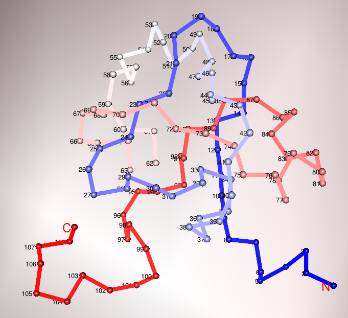

##Abstract

From a topological point of view, polymers can be modeled as open polygonal paths. Upon closure, these paths generate topological objects called knots. Multi-component knots are known as links. Rknots provides functions for the topological analysis of knots and links with a particular focus on biological polymers (e.g. proteins).

This vignette is divided in three main parts:

1. Data import and datasets
2. Methods
3. Case study illustrating how to use Rknots to identify knots in proteins.

For more details on the methods, please refer to [Comoglio and Rinaldi, 2011](http://www.ncbi.nlm.nih.gov/pubmed/21533239) and [Comoglio and Rinaldi, 2012](http://www.ncbi.nlm.nih.gov/pubmed/22492311). 

####Remarks
Rknots has been developed as a generalized framework. Theoretically, any arbitrary structure compliant with the requirements below can be loaded. Practically, this depends on the complexity of the structure to be analyzed, the task to be performed, and available memory.

##Data import and structure

Rknots deals with knots and links. These are represented as the coordinates of \\(N\\) points in the three-dimensional space and a set of integer separators. \\(N\\) points in 3D can be naturally represented by a \\(N \times 3\\) matrix, where each row is a point and columns are \\(x,y,z\\) coordinates. A knot is entirely defined by its points. However, an integer vector \\(S\\) of length \\(n-1\\) is required to represent \\(n\\)-component links. The elements of \\(S\\) are called separators and describe the boundaries between components. Particularly, we defined a separator as the index of the edge that if not removed would connect components across. 

<center> </center>

For example, the Hopf link represented above is defined by an \\(8 \times 3\\) matrix and separator \\(S=\{4\}\\). The edge that would connect the two components is indicated by the gray dashed line.

###Datasets

Rknots provides two datasets:

1. The Rolfsen table of 250 knots with less than 11 crossings (enumerated according to [Rolfsen](http://www.math.toronto.edu/~drorbn/KAtlas/Knots)). Full and minimal stickies representations are stored in the Rolfsen.table and Rolfsen.table.ms datasets, respectively. To load a dataset, type:

	```{r eval=TRUE}
	library(Rknots)
	data(Rolfsen.table)
	str( head(Rolfsen.table, 5) )
	head( names(Rolfsen.table) )
	```

	Note that knots are elements of a named list. Thus, instances can also be accessed by name

	```{r eval=TRUE}
	str( Rolfsen.table['3.1'] )
	```

	The difference between the full representation of a trefoil knot and its minimal stickies representation is shown below.

	<center> </center>


2. Coordinates and separators of 130 links up to 4 components, stored in the link.table dataset.

	```{r eval=TRUE}
	data(link.table)
	str( head(link.table, 5) )
	head( names(link.table) )
	```

	Each element of the list has two slots containing link coordinates and separators.

We now randomly sample a knot and a link structure to illustrate the main features of the package in the next sections.

```{r eval=TRUE}
set.seed(123)

knot <- makeExampleKnot(k = TRUE) #a knot
link <- makeExampleKnot(k = FALSE) #a link
```

###Creating objects of class Knot

Rknots introduces an S4 class called Knot. An object of class Knot has two mandatory slots:

1. points3D: an \\(N \times 3\\) matrix, where each row is a point and columns are \\(x,y,z\\) coordinates of a polygonal knot or link
2. ends: a vector of integers containing the separators of the link components. This slot is by default set to numeric(0) for knots.

An new instance of a Knot object can be created either by the class constructor newKnot or with the generic constructor new. 

```{r eval=TRUE}
knot.cls <- new('Knot', points3D = knot)
link.cls <- new('Knot', points3D = link$points3D, ends = link$ends)

( knot.cls <- newKnot(points3D = knot) )
( link.cls <- newKnot(points3D = link$points3D, ends = link$ends) )
```

Slots can be accessed with the accessors getCoordinates and getEnds, or by subsetting with the [ operator. Direct access with @ is discouraged.

```{r eval=TRUE}
head( getCoordinates(knot.cls), 5 )
getEnds(knot.cls)

head( link.cls['points3D'], 5)
link.cls['ends']
```

Similarly, slots can be modified by the setters setCoordinates, setEnds or using the [<- operator.

```{r eval=TRUE}
knot.bu <- knot.cls #copy
new.coordinates <- matrix( runif(60), ncol = 3 ) #generate random coordinates
setCoordinates(knot.cls) <- new.coordinates #replace
knot.cls
knot.cls <- knot.bu #restore

link.bu <- link.cls #copy
setEnds(link.cls) <- c(10, 50, 90) #replace separators
getEnds(link.cls)
link.cls <- link.bu #restore
```

Note that Rknots does not expect the new vector of separators to be of the same length as the original one, i.e. it is possible to change the link type and this is useful when local operations on the link are performed. 

##Simplyfing structures and computing invariants

The computational cost of polynomial invariants is generally very high. Therefore, structures must be reduced beforehand by reducing the number of points while retaining the topology of the original structure. 

To this end, two structure reduction algorithms have been implemented in Rknots:

1. the Alexander-Briggs (AB) algorithm based on elementary deformations [Alexander and Briggs, 1926](http://www.maths.ed.ac.uk/~aar/papers/alexbriggs.pdf); Reidemeister, 1926.
2. the Minimal Structure Reduction (MSR) algorithm [Comoglio and Rinaldi, 2011](http://www.ncbi.nlm.nih.gov/pubmed/21533239) based on generalized Reidemeister moves.

The AB algorithm is very efficient, whereas the MSR algorithm, by working on the knot projection, contains intrinsically more information but is significantly slower. The reduction can be applied directly to coordinates and separators

```{r eval=TRUE}
knot.AB <- AlexanderBriggs(points3D = knot, ends = c())
str(knot.AB)
knot.msr <- msr(points3D = knot, ends = c())
str(knot.msr)

link.AB <- AlexanderBriggs(points3D = link$points3D, ends = link$ends)
str(link.AB)
link.msr <- msr(points3D = link$points3D, ends = link$ends)
str(link.msr)
```

or to an object of class Knot with the reduceStructure function.

```{r eval=TRUE}
knot.cls.AB <- reduceStructure(knot.cls, algorithm = 'AB' )
knot.cls.MSR <- reduceStructure(knot.cls, algorithm = 'MSR' )
link.cls.AB <- reduceStructure(link.cls, algorithm = 'AB' )
link.cls.MSR <- reduceStructure(link.cls, algorithm = 'MSR' )
link.cls.AB
```

The function msr (and the MSR method) return both the simplified structure, as well as the intersection matrix \\(M\\), which contains position and sign of the crossings in the knot/link diagram. This function can also be used to partially reduce structures by controlling the number of iterations (default to 100).

The original and simplified structures can be inspected by plotting a knot diagram with plotDiagram.

```{r eval=TRUE}
par( mfrow=c(1,2) )

#plotDiagram(knot.AB$points3D, knot.AB$ends, lwd = 2, main = 'Alexander-Briggs')
#plotDiagram(knot.msr$points3D, knot.msr$ends, lwd = 2, main = 'MSR')
plotDiagram(link.AB$points3D, link.AB$ends, lwd = 2, main = 'Alexander-Briggs')
plotDiagram(link.msr$points3D, link.msr$ends, lwd = 2, main = 'MSR')
```

or directly with the plot function is the object is of class Knot.

```{r eval=TRUE}
plot(link.cls.AB, lend = 2, lwd = 3, main = 'using par()')
```

##Computing polynomial invariants of knots and links

Rknots can be used to compute the following invariants:

+ Knots: 
	+ Alexander polynomial
	+ Jones polynomial
	+ HOMFLY polynomial
+ Links:
	+ Jones polynomial
	+ HOMFLY polynomial
	+ multivariable Alexander polynomial
	+ linking number

Given an object of class Knot, invariants can be computed with computeInvariant. The function internally discriminates between knots and links and returns the appropriate polynomial as follows:

```{r eval=TRUE}
( delta.k <- computeInvariant( knot.cls.AB, invariant = 'Alexander') )
jones.k <- computeInvariant( knot.cls.AB, invariant = 'Jones', skein.sign = -1)
homfly.k <- computeInvariant( knot.cls.AB, invariant = 'HOMFLY', skein.sign = -1)

( delta.l <- computeInvariant( link.cls.AB, invariant = 'Alexander') )
jones.l <- computeInvariant( link.cls.AB, invariant = 'Jones', skein.sign = -1)
homfly.l <- computeInvariant( link.cls.AB, invariant = 'HOMFLY', skein.sign = -1)
```

When possible, Rknots allows to convert a polynomial invariant into another. For example, the HOMFLY polynomial can be converted to the Jones polynomial by

```{r eval=TRUE}
converted <-HOMFLY2Jones( homfly.k )
identical( converted, jones.k)
```

For some applications, the linking number of a link is desired. The linking number of a polygonal link can be computed with

```{r eval=TRUE}
( computeInvariant( link.cls.AB, invariant = 'LK') )
```

###Example: the first 6 knots in the Rolfsen table

An illustration of the very beginning of the Rolfsen knot table can be generated as follows.

```{r eval=FALSE}
data(Rolfsen.table)
text <- names(Rolfsen.table)[1 : 6]

par(mfrow = c(3,2))
for(i in 1 : 6) { 
  k <- Rolfsen.table[[i]]
  k <- newKnot(k)
  plot(k, lwd = 2, main = text[i], 
       sub = paste( computeInvariant(k, 'Alexander'), 
                    computeInvariant(k, 'Jones'),
                    computeInvariant(k, 'HOMFLY'), sep = '\n'))
}        
```

<center> </center>

##Case study: Protein knot analysis

In this section, we apply Rknots to detect and characterize knots in proteins. Two PDB files are part of the package data and will be used in the following case study:

+ The Rds3p protein (PDB identifier 2K0A), a member of the U2 snRNP essential for pre-mRNA splicing. Rds3p features a left-handed trefoil knotted structure [van Roon et al. 2008](http://www.ncbi.nlm.nih.gov/pubmed/18621724)
+ The first chain (A) of the E. Coli alkaline phosphatase (D153G mutant). This protein presents a structural gap, a potential source of false positives.

A protein can be loaded from the file system or fetched from the Protein Data Bank  using the loadProtein function, which returns a list of matrices where each element contains the 3D coordinates of a given protein chain. By default, loadProtein performs gap finding for each chain backbone. A cutoff parameter corresponding to the maximum allowed euclidean distance between two consecutive alpha-Carbon residues facilitates a custom definition of a gap. If a distance is greater than cutoff, the chain is split at the corresponding position and subchains are generated. 

```{r eval=TRUE}
protein <- loadProtein(system.file("extdata/2k0a.pdb", package="Rknots"))
protein<- loadProtein('2K0A') #from the PDB
str(protein)
```

The 3D structure of the imported protein and the corresponding backbone model can be then visualized with plotKnot3D, which leverages on the superb graphics of the rgl package. Particularly, any parameter of the rgl functions lines3d and spheres3d can be supplied.

```{r eval=FALSE}
ramp <- colorRamp(c('blue', 'white', 'red'))
pal <- rgb( ramp(seq(0, 1, length = 109)), max = 255)

plotKnot3D(protein$A, colors = list( pal ), 
	lwd = 8, radius = .4, showNC = TRUE, text = TRUE)
```

By setting ```showNC = TRUE``` the chain is oriented by labeling the protein N-ter and C-ter, whereas ```text = TRUE``` adds a residue number to each point. A snaphot of the 3D plot is illustrated below.

<center> </center>

To find knots in proteins, a single chain has to be supplied and coerced to a Knot object. The available chains are returned by loadProtein.

```{r eval=TRUE}
protein <- newKnot(protein$A)
protein
```

Closure and projection can then be performed using closeAndProject. This function applies a Principal Component Analysis on the closed structure to simplify the computation of invariants and for visualization purposes. 

```{r eval=TRUE}
protein.cp <- closeAndProject( protein, w = 2 )
```

```{r eval=FALSE}
par(mfrow = c(1,2))
plot(protein, main = 'original', lwd = 2)
plot(protein.cp, main = 'closed & projected', lwd = 2)
```

<center> </center>

Next, invariants can be computed with

```{r eval=TRUE}
( delta.p <- computeInvariant( protein.cp, invariant = 'Alexander') )
( jones.p <- computeInvariant( protein.cp, invariant = 'Jones', skein.sign = -1) )
( homfly.p <- computeInvariant( protein.cp, invariant = 'HOMFLY', skein.sign = -1) )
```

For simple knots, the knot type can be assigned automatically using getKnotType

```{r eval=TRUE}
getKnotType(polynomial = delta.p, invariant = 'Alexander')
getKnotType(polynomial = homfly.p, invariant = 'HOMFLY')
getKnotType(polynomial = homfly.p, invariant = 'HOMFLY', full.output = TRUE)
```

The results indicate the Rds3p protein has a left-handed knot, which can be compared with the right-handed trefoil polynomial in the Rolfsen knot table by means of another Rknots utility:

```{r eval=TRUE}
trefoil <- Rolfsen.table[[1]]
trefoil <- newKnot(trefoil)
( homfly.tr <- computeInvariant(trefoil, 'HOMFLY') )
( homfly.tl <- HOMFLY2mirror(homfly.tr) )
identical( homfly.p, homfly.tl )
```

Finally, if a protein has more than one chain one can interate over all possible chains using lapply. The following code illustrates how to perform this analysis by fetching a protein with two chains from the PDB

```{r eval=TRUE}
processChain <- function(protein, i) {
	chain <- newKnot(protein[[i]])
	chain <- closeAndProject( chain )
	return( computeInvariant(chain, 'HOMFLY') )
}        

lengthChain <- function(protein, i) return( nrow(protein[[i]]))

protein <- loadProtein('1AJC', join.gaps = FALSE, cutoff = 7)
str(protein)
chains <- names(protein)        
polynomials <- lapply( 1: length(chains) , 
		function(i) {
			ifelse(lengthChain(protein, i) > 6, processChain(protein, i), 1) } )
cbind(chains, polynomials)     
```

The results indicate that the first chain has been split and resulted in a two unknotted subchains. The second chain instead bears a right-handed trefoil knot. Note: by ignoring gap finding, we would have found a knot in the first chain.

```{r eval=TRUE}
protein <- loadProtein('1AJC', join.gaps = TRUE)
str(protein)
chains <- names(protein)        
polynomials <- lapply( 1: length(chains) , 
		function(i) {
			ifelse(lengthChain(protein, i) > 6, processChain(protein, i), 1) } )
cbind(chains, polynomials)        
```

## Session Info
```{r eval=TRUE}
sessionInfo()
```

## References

Adler D. and Murdoch D. rgl: 3D visualization device system (OpenGL).

Alexander J.W. and Briggs G.B. (1926) On types of knotted curves. Ann of Math, 28, 562-586.

Comoglio F. and Rinaldi M. (2011) A Topological Framework for the Computation of the HOMFLY Polynomial and Its Application to Proteins. PLoS ONE 6(4), e18693.

Comoglio F. and Rinaldi M. (2012) Rknots: topological analysis of knotted biopolymers with R. Bioinformatics 28(10), 1400-1401.

Reidemeister K. (1926), Abh Math Sem Univ Hamburg 5: 24-32.

van Roon A.M.,  Loening N.M.,  Obayashi E.,  Yang J.C.,  Newman A.J.,  Hernandez H.,  Nagai K. and  Neuhaus D., (2008) Solution structure of the U2 snRNP protein Rds3p reveals a knotted zinc-finger motif, Proc Natl Acad Sci USA, 105, 9621-9626.

